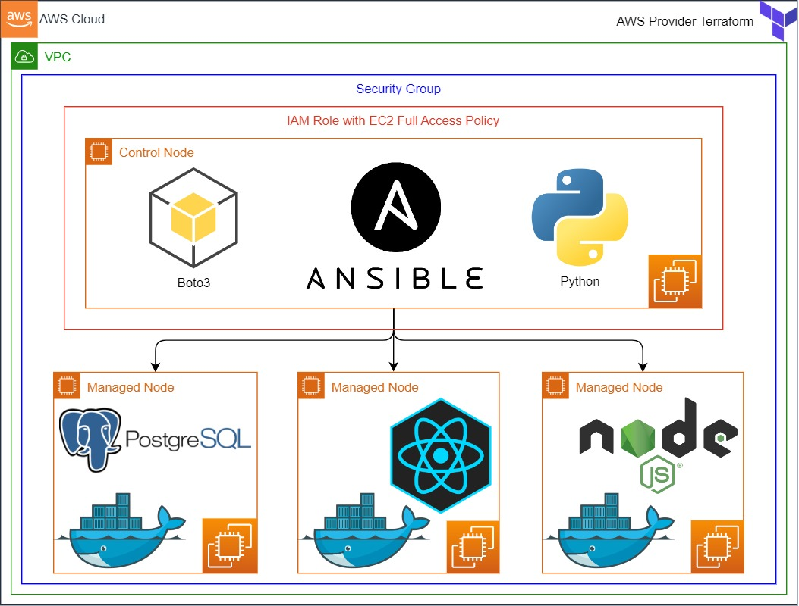
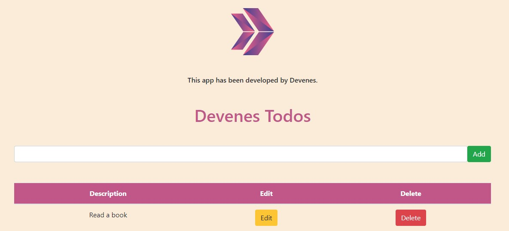
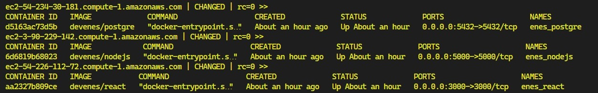

<h1 align="center">
Microservice-Based Web Application deployed on AWS with Terraform, Ansible and Docker
</h1>

<p align="center">
  <a href="#dart-about">About</a> &#xa0; | &#xa0; 
  <a href="#-project-architecture">Project Architecture</a> &#xa0; | &#xa0;
  <a href="#rocket-technologies">Technologies</a> &#xa0; | &#xa0;
  <a href="#white_check_mark-requirements">Requirements</a> &#xa0; | &#xa0;  
  <a href="#-Case-Study-Details">Case Study Details</a> &#xa0; | &#xa0;
  <a href="#memo-license">License</a> &#xa0; | &#xa0;
</p>

## :dart: About ##

Microservice-Based Web Application aims to deploy web-page written Nodejs and React Frameworks on AWS Cloud Infrastructure using Ansible. Building infrastructure process is managing with control node utilizing Ansible. This infrastructure has 1 control node and 3 EC2's as worker node. These EC2's will be launched on AWS console. Web-page has 3 main components which are postgresql, nodejs, and react. Each component is serving in Docker container on EC2s dedicated for them. Postgresql is serving as Database of web-page. Nodejs controls backend part of web-side and react controls frontend side of web-page. 

## 📜 Project Architecture ##



## :rocket: Technologies ##

The following tools were used in this project:

- [Docker](https://www.docker.com/)
- [Javascript](https://developer.mozilla.org/en-US/docs/web)
- [React.js](https://reactjs.org/)
- [Node.js](https://nodejs.org/)
- [Ansible](https://www.ansible.com/)
- [AWS](https://aws.amazon.com/)
- [PostgreSQL](https://www.postgresql.org/)
- [Git](https://git-scm.com/)
- [Github](https://github.com/)
- [Terraform](https://www.terraform.io/)

## :white_check_mark: Requirements ##

Before starting :checkered_flag:, you need to have [Git](https://git-scm.com), [Node](https://nodejs.org/en/), [Docker](https://www.docker.com/), [Terraform](https://www.terraform.io/), [Ansible](https://www.ansible.com/), [React](https://reactjs.org/) and [AWS account](https://aws.amazon.com/).

# Web Application Deployment using Ansible

## Overview
This project was developed by Varun Kumar Shekar, Shreyas MM, Vani Basappa Goudar and Vinutha S, a full-stack development and DevOps team, to build and deploy a web application that collects user information. The application consists of a **PostgreSQL database**, a **Node.js backend**, and a **React frontend**, all running inside Docker containers on separate AWS EC2 instances.

The deployment is automated using **Ansible**, ensuring a smooth and consistent setup.

## Architecture
- **PostgreSQL** (Runs on EC2 instance, listens on port **5432**)
- **Node.js Backend** (Runs on EC2 instance, listens on port **5000**)
- **React Frontend** (Runs on EC2 instance, broadcasts on port **80**)
- **Control Node** (Handles deployment using Ansible)
- **Dynamic Inventory** (AWS EC2 instances managed dynamically)

### Security Groups
- **PostgreSQL EC2:** Accepts traffic from **Node.js EC2 (port 5432)** and SSH (port 22)
- **Node.js EC2:** Accepts traffic from **anywhere (port 5000)** and SSH (port 22)
- **React EC2:** Accepts traffic from **anywhere (port 80)** and SSH (port 22)

## Deployment Process
Deployment is managed through Ansible and consists of the following steps:

### Prerequisites
1. AWS account with IAM access to create EC2 instances.
2. Ansible installed on the **Control Node**.
3. SSH access configured for EC2 instances.
4. A **GitHub repository** containing application code.
5. Ansible Vault for securing database credentials.

### Deployment Steps
1. **Set Up the Control Node**
   - Install Ansible.
   - Configure `ansible.cfg` and dynamic inventory.
   - Pull source code from GitHub.

2. **Deploy PostgreSQL**
   - Transfer `Dockerfile` and `init.sql` to the PostgreSQL EC2 instance.
   - Build and start the PostgreSQL container with environment variables secured using **Ansible Vault**.
   - Create a Docker volume to persist database data.

3. **Deploy Node.js Backend**
   - Update `.env` file with PostgreSQL connection details.
   - Transfer the `server` folder to the Node.js EC2 instance.
   - Build and start the Node.js container on **port 5000**.

4. **Deploy React Frontend**
   - Update `.env` file with the Node.js API endpoint.
   - Transfer the `client` folder to the React EC2 instance.
   - Build and start the React container on **port 80**.

## Ansible Playbooks
We have structured our Ansible playbooks in three different ways:

1. **Separate Playbooks for Each Service** (PostgreSQL, Node.js, React)
2. **Single Playbook without Roles**
3. **Single Playbook with Roles**

### How to Run the Playbooks
1. Clone the repository:
   ```bash
   git clone https://github.com/your-repo.git
   cd your-repo
   ```

2. Run the playbooks:
   - **Option 1:** Run individual playbooks for each service:
     ```bash
     ansible-playbook deploy_postgres.yml
     ansible-playbook deploy_nodejs.yml
     ansible-playbook deploy_react.yml
     ```
   - **Option 2:** Run a single playbook:
     ```bash
     ansible-playbook deploy_all.yml
     ```
   - **Option 3:** Run the playbook with roles:
     ```bash
     ansible-playbook site.yml
     ```

3. Verify the deployment by accessing the React frontend via the **public IP** of the React EC2 instance.

## Technologies Used
- **Frontend:** React.js
- **Backend:** Node.js (Express)
- **Database:** PostgreSQL
- **Containerization:** Docker
- **Cloud Provider:** AWS (EC2, Security Groups)
- **Automation:** Ansible (Playbooks, Dynamic Inventory, Ansible Vault)


## Expected Outcome



- ### Check the status of containers on managed nodes

```bash
ansible all -m shell -a "docker ps -a"
```



- ### API Usage: Add todo using POST method
<!-- > curl -X POST -H "Content-Type: application/json" -d '{"title":"Todo Title", "description":"Todo Description"}' http://nodejsserver:5000/todos -->

> Replace your Node.js server DNS address and port number

```bash
curl --request POST \
--url 'http://3.90.229.142:5000/todos' \
--header 'content-type: application/json' \
--data '{"description":"Learn Ansible"}'
```

### At the end of the project, following topics are covered;

- Ansible playbook preparation without roles

- Ansible playbook preparation with roles.

- Bash scripting

- AWS Security groups create and attach to EC2.

- Launch EC2 and it's configurations

- Write dockerfile for postgresql, nodejs and react images.

- Docker image creation for postgresql, nodejs and react containers with ansible playbook

- Docker container launching using created image with ansible playbook

- Git & Github for Version Control System


## 📚 Resources

- [Ansible Documentation Framework](https://docs.ansible.com/ansible/2.5/user_guide/index.html)

- [AWS CLI Command Reference](https://docs.aws.amazon.com/cli/latest/index.html)

- [Terraform Documentation](https://www.terraform.io/docs/commands/index.html)

- [React Documentation](https://reactjs.org/docs/getting-started.html)

- [Nodejs Documentation](https://nodejs.org/en/docs/)

- [PostgreSQL Documentation](https://www.postgresql.org/docs/9.6/static/index.html)

<a href="#top">⬆️ Back to top</a>
